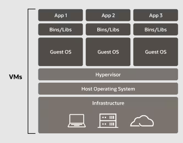
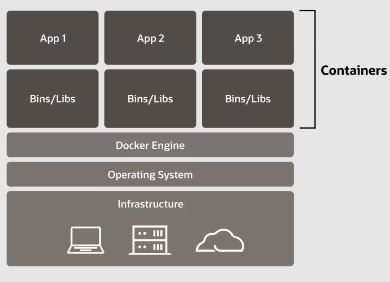
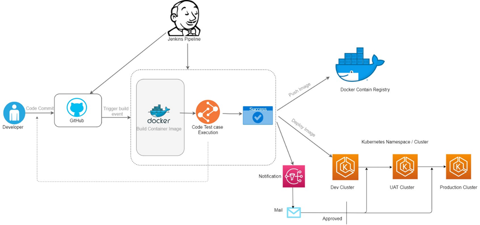
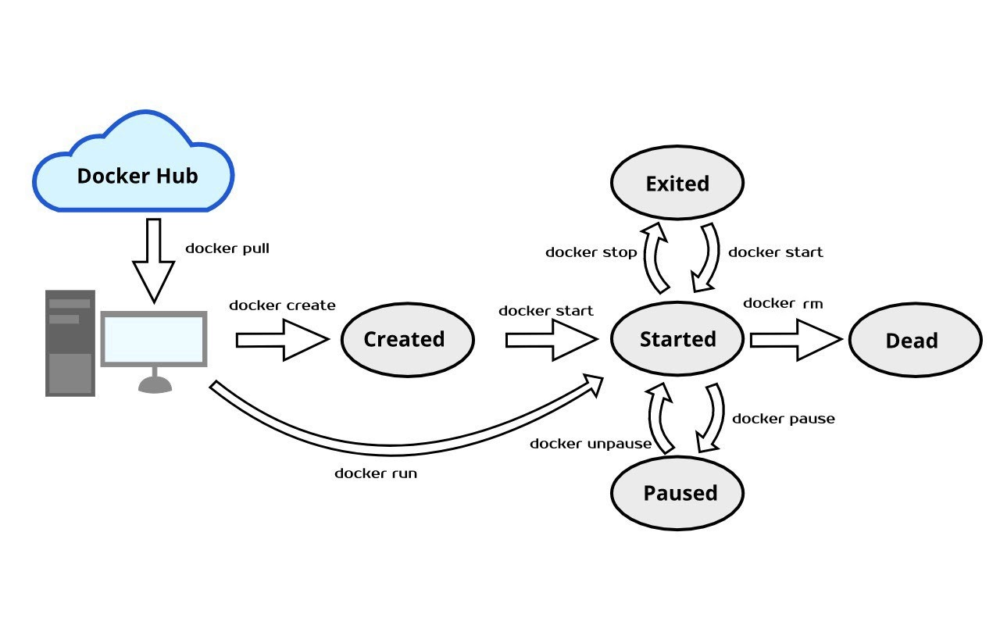
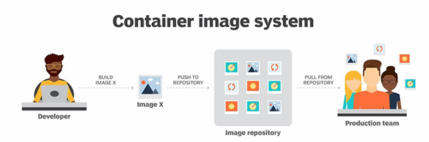
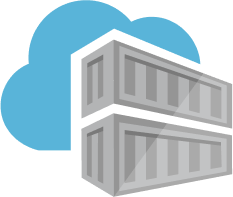
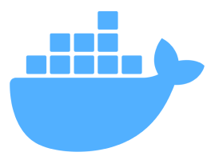
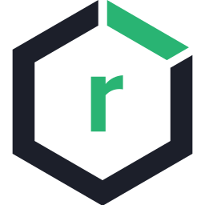

# **Introduction to Containerization**

In this section, we will introduce containerization technology, providing a basic overview of containers and their use case in microservices deployment.

## Types of Deployment
### Traditional Deployment
Initially, applications were deployed on physical servers, sharing the resources. This approach led to many problems due to conflicts with libraries, dependencies, and other performance needs. One solution was to deploy applications on separate servers, but this was costly and resulted in underutilized resources.

### Virtualized Deployment
Virtualization is a technology that allows the creation of one or more running environments simulated within a pool of shared resources. These resources are efficiently coordinated and provided as virtual resources by the hypervisor. This technology enhances resource utilization, improves scalability, and simplifies the management of IT infrastructure by allowing multiple virtual machines to run on a single physical machine.


<p align="center">
  
</p>


## Introduction to Container technology
Containers are software units that run on the host's operating system. This approach offers the advantage of not requiring any modifications to the application to adapt it to the host's environment, making transitions between environments easy and seamless.\
Containers provides also isolation, portability, and efficiency by packaging everything an application needs to run, without the overhead of a full OS.
<p align="center">
  
</p>

Containers are similar to virtual machines but much lighter, as they contain only the essential components needed to run an application, such as:
- **runtime**: the minimal runtime environment needed to execute the application; this typically includes system libraries, shared resources, and the necessary binaries.
- **code**: containers encapsulate the application code; unlike VMs, which run an entire guest OS, containers share the host OS kernel and only package the application-specific code and dependencies.
- **tools**: any necessary tools and utilities required by the application to perform its functions (such as scripts, binaries, executables and debugging tools).
- **libraries**: the dependencies and libraries that the application relies on to run, ensuring all necessary software is included without the overhead of a full operating system.

### Examples of Container Technologies
Of continuation, they want to bring back some technologies that offer various options of containerizzazione, each with own points of force and areas of interest, in order to satisfy various requirements and use cases in the management and orchestration of the container.
- **Docker**: the most widely used containerization platform; it allows you to package applications and their dependencies into lightweight containers; Docker images are read-only templates used for building containers; Dockerfiles instead provides instructions for creating these images.
- **Podman**: an open source daemon-less container management tool; it focuses on security and compatibility, making it a great alternative for those who prefer not to use Docker (it provides a Docker-compatible CLI).
- **Kurbenets**:  it is not a container technology itself, it is an open-source container orchestration platform that automates deploying, scaling, and managing containerized applications (important to say that Kubernetes works seamlessly with Docker and other container runtimes).

### Use cases of Containers
#### Microservices and Applications Isolation
In recent years, the use of distributed applications, microservices, etc., has become extremely widespread.
When we talk about these techniques for software development the use of containter is crucial. Let’s analyze the reasons.
- **Decoupling of Services**: containers enable the decomposition of monolithic applications into smaller, independent microservices; in a microservices-based application, the monolithic architecture is decomposed into smaller services - each microservice handles a specific feature or task independently.
- **Team Efficiency**: each teams can focus on specific services, leading to efficient deployment processes and service discovery (each microservice can be developed, deployed, and scaled independently - enhances agility and speed of delivery).
- **Consistent Environment**: containers encapsulate all dependencies and configurations required to run a service - ensures that the application behaves consistently across different environments (development, testing, production - ideally no more "it works on my machine").
- **Resource Isolation**: this feature helps prevent conflicts and enhances security by limiting the impact of potential vulnerabilities; containers provide a lightweight form of isolation by packaging applications and their dependencies separately from the host system and other containers.
- **Scalability**: containers can be easily scaled up or down to meet demand (particularly important in fog and cloud) - Kubernetes and other orchestration tools manage containerized applications at scale, enabling efficient resource utilization and load balancing.
- **Fault Isolation**: if one microservice in a container crashes, it doesn’t affect the others; this feature ensures that an issues in one part of the application don’t bring down the entire system.

#### CI/CD
By integrating containers into CI/CD workflows, organizations can achieve greater efficiency, reliability, and speed in their software development processes.
Containers have revolutionized the CI/CD process, offering numerous benefits that streamline software development, testing, and deployment.
Here’s how containers enhance CI/CD workflows:
- **Faster Build and Deployment**: containers can be built and started quickly, which accelerates the build and deployment process - allow for rapid iteration and continuous delivery - ensuringg improving reliability and security.
- **Isolation of CI/CD Processes**: each stage of the CI/CD pipeline (build, test, deploy) can run in its own container, isolated from the others.
- **Parallel Testing**: containers can run multiple instances of tests in parallel, speeding up the testing phase.
- **Environment Parity**: this feature reduces the risk of deployment issues and ensures that the application behaves as expected - containers provide an isolated and consistent environment, the same container image used for testing can be deployed to production.
- **Rollback Capability**: the images of the container are immutable, once built, do not change; this is important because allows easy rollback to previous versions if something goes wrong during deployment.
<p align="center">
  
</p>

_**Jenkins** serves as a DevOps tool that automates the process of integrating code changes, testing, and deploying software applications; is an open-source automation server primarily used for implementing Continuous Integration (CI) and Continuous Delivery (CD) practices in software development._


## Container's lifecycle
#### Image
A container is created by the execution of an image, it implements an incremental file system (overlay), with layer on top of others, each command represents a layer and are read only. Each layer depends pn the layers underneat. When running, a container will have a writable layer on top called "container" layer.
Once used a container can be turned into an image, turning the container layer in read only an image layer.

#### Container (e.g. with Docker)
- **Dockerfile**: defines the environment and settings for your application's Docker image - script (instructions) to build a Docker image.
- **Image**: a read-only template with instructions for creating a Docker container - it is built from a Dockerfile.
- **Container**: a running instance of a Docker image - each container is isolated and can be started, stopped, moved, and deleted.

<p align="center">
  
</p>

#### Lifecycle states (e.g. with Docker)
- **Created**: The container has been created but not started (creating a new container from the image) - ```docker start <container_id>```.
- **Running**: The container is currently executing on the host operating system but is isolated from it, it has its own filesystem and networking.
- **Paused**: The container’s processes are temporarily suspended.
- **Stopped**/**Restarting**: The container has been stopped and can be restarted - ```docker stop <container_id>``` and ```docker restart <container_id>```.
- **Deletion**: Once the container is stopped, it can be deleted (removes the filesystem that was created when the container was instantiated from the image) - ```docker rm <container_id>```.
<p align="center">
  
</p>

#### What is Open Container Initiative (OCI)?
The OCI is a vendor-neutral initiative established by Docker, CoreOS and other leaders in the container industry with the objective of creating an industry standard around container technology to ensure that different tools and platforms can work together seamlessly.\
The aim is to ensure standardization and interoperability among various tools and platforms within the container ecosystem, facilitating seamless collaboration and development across different projects and organizations.

The Open Container Initiative has developed two main specifications to standardize container technology:
- **Image format**: this specification outlines how to create an OCI Image, which typically involves a build system generating an image manifest, a filesystem (layer) serialization, and an image configuration; at a high level, an OCI implementation would download an OCI Image, then unpack that image into an OCI Runtime filesystem bundle.
- **Runtime specification**: a document that describes how to run a "filesystem bundle" that is unpacked on disk.
- **Distribution Specification**: it was introduced to standardize the API to distribute container images; the specification is designed generically enough to be leveraged as a distribution mechanism for any type of content.

#### Container repository
Once an image is created, we can save the image in a public or private repository, called registry.

## Container distribution
As mentioned before, containers are typically stored in repositories called **registries**. These registries serve as a place for developers to store and share container images by `uploading (pushing)` them to the registry and `downloading (pulling)` them onto other systems. This process saves developers valuable time in the creation and delivery of cloud-native applications by acting as an intermediary for sharing container images between different environments.

<p align="center">
    
</p>


### Types of registries

The registries can be categorized by:
 - How they are hosted
   - **Remote**: Hosted on a cloud platform or external service provider.
   - **Self-hosted**: Deployed on-premise within an organization's own infrastructure.
 - Accessibility:
   - **Public**: Accessible to anyone in the Internet, typically used for sharing applications that developers want to make available to the public.
   - **Private**: Accessible only by selected users and include additional security measures, designed to ensure privacy for enterprise container images. 
 - Licence type:
  - **Open Source**: Like Docker's registry tool, they provide more flexibility and customization options.
  - **Proprietary**: The code is not public, meaning that it can't be customized.


### Notable container registries
        


The major container registries are:
 - **Docker Hub** : the most popular registry at the moment, used by both small and big vendors.
 - **Amazon Elastic Container Registry (ECR)** : ideal for those that already use the AWS platform to host applications.
 - **Azure Container Registry**: Offers geo-replication ensuring that everyone has the same access to images and at comparable speeds in different locations. 
 - **Red Hat Quay** : Offers private registries only, suitable for enterprise-level customers, offers geo-location services like Azure and more.
 - **Github Container Registry**: Integrated with Github platform and user base, allows also Github's commands. 
 - **Google Container Registry**: Ideal for those that want to stick to the Google Products, not as much for those who don't want to get locked into it.

> [!NOTE]
> Be aware to use only images from trusted authors or official distributors.

## Container Plugins
- **Isolation customization**: in the context of container orchestration systems like Kubernetes, isolation customization refers to the ability to adjust how pods (containers) are isolated from each other and the underlying infrastructure; this can involve setting up network policies, security contexts, and resource quotas to ensure that containers operate securely and efficiently.
- **Volumes**: volumes are a mechanism for persisting data generated by and used by Docker containers.; they allow data to survive beyond the lifecycle of a single container instance, facilitating data persistence and sharing among containers.
- **Secrets**: Secrets are used to store sensitive information such as passwords, OAuth tokens, and ssh keys; they are designed to be tightly controlled and secure, ensuring that secrets are not exposed outside where they are intended to be used.
- **Networks**: networking is a passage through which all the isolated container communicate - there are mainly five network drivers in Docker (such as bridge, host, none, overlay, and macvlan); in Docker, networking is indeed a crucial component that allows isolated containers to communicate with each other.


## Sources and additional readings:
- https://www.oracle.com/it/cloud/cloud-native/container-registry/what-is-docker/
- https://www.geeksforgeeks.org/what-is-docker-image/
- https://www.redhat.com/it/topics/cloud-native-apps/what-is-a-container-registry
- https://docs.docker.com
- https://octopus.com/blog/top-8-container-registries
- https://bluelight.co/blog/how-to-choose-a-container-registry#what-is-a-container-registry
- https://sysdig.com/learn-cloud-native/what-is-a-container-registry/


