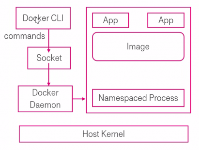

# Docker Overview
Docker is an open-source platform that enables developers to automate the deployment, scaling, and management of applications within lightweight, portable containers.\
This ensures that the application will run on any others machine regardless of any customized settings that machine might have that could differ from the machine used for writing and testing the code.

### Docker Architecture
<p align="center">
  
</p>

- **Docker CLI**: is the interface through which users interact with Docker; users input commands here to manage Docker containers, images, networks, and more (we will analyse some commands in the following sections). 
- **Socket**: is the communication bridge between the Docker CLI and the Docker Daemon; it allows the CLI commands to be sent to the Daemon.
- **Docker Daemon**/**Docker Engine**: is the core part of Docker that runs on the host machine, it is responsible for creating, running, and managing containers; it also listens for Docker API requests and manages Docker objects such as images, containers, networks, and volumes.
- **App**: applications that run inside containers, multiple applications can run in isolation from each other within their own containers.
- **Image**: a lightweight, standalone, and executable package that includes everything needed to run a piece of software - including the code, runtime, libraries, environment variables, and configuration files.
- **Namespaced Process**: containers run as namespaced processes; namespaces provide isolated views of system resources (such as process IDs, network access, user IDs, and file systems) for each container, ensuring they do not interfere with each other or with the host system.


### Key Features of Docker
- **Portability**: docker containers can run on any system that supports Docker, regardless of the operating system - ensuring consistency across development, testing, and production environments.
- **Version Control**: containers are lightweight because they share the host system's kernel, making them more resource-efficient than traditional virtual machines.
- **Isolation**: each container runs in isolation from others, preventing conflicts between others container or the host system (but also prevents conflict with applications and their dependencies).
- **Continuous Integration and Continuous Deployment (CI/CD)**: docker integrates well with CI/CD tools, allowing for streamlined development pipelines (automated testing, building and deployment processes).
- **Efficient Resource Utilization**: docker images can be versioned and tagged, allowing for easy rollbacks and updates.
- **Scalability**: docker makes it easy to scale applications by starting new containers as needed.
- **Security**: docker containers are isolated from each other and the host system, providing an additional layer of security.

____
## Basic Information
- **dockerfile**\
A Dockerfile is a script that contains a series of commands to build a Docker image.\
It specifies the base image, commands to install dependencies, copy files, set environment variables, and specify the command to run the application. _We analyze it specifically in the next section._


- **docker-compose.yml**\
Docker Compose is a tool that simplifies the management of multi-container Docker applications through a YAML configuration file.\
This file defines the services (containers) that make up your application, including their configurations such as images to use, ports to expose, network settings, and volume mounts.\
You can start all services with a single terminal command, making it easier to replicate and manage complex applications across different environments.


- **application.yml**\
It is a YAML-based configuration file used in Spring Boot to externalize application settings - hierarchically properties, for a more readable configuration.\
Spring Boot automatically loads these properties at runtime - flexible and centralized management. 
_It is usually located in the resources package._


- _**terminal commands** (bash)_\
  We can distinguish in two main categories: ```docker-compose``` and ```docker``` commands.\
  _(Some of the most important and used commands are reported here; many of these are very similar to commands that are used in a normal linux shell, or still very intuitive.)_\
  For ```docker-compose```, we can have:
  - ```build``` to **build** or rebuild services;
  - ```up``` to **start** the service (defined in the yaml file);
  - ```down``` to **stop** and remove the service.
  
  In the simple ```docker``` world we can manage:
  - the **volumes**: with ```volume create``` we can create a volume, and with ```volume rm``` you can remove it.
  - the **network**: as the same as volumes, we can create a new network with ```network create``` and remove it with ```network rm```
  - the **images**: ```build -t <image-name>``` to create a new image, with ```pull <image-name>``` instead we can download an image from a Docker registry, such as the [Docker Hub]( https://hub.docker.com/ ) (e.g. ```docker pull ubuntu:20.04```).
  - the **container itself**:
    - ```run <image-name>``` run a container from an image, obviously.
    - ```ps``` shows the running containers (with ```-a``` parameter we can see even those who are not running);
    - ```start <container-id>``` or ```stop <container-id>``` commands run or stop a container, ```rm <container-id>``` instead remove the container; rm
    - ```docker exec``` runs a command in a running container (e.g. ```docker exec -it <container-id> bash``` open an interactive -bash- shell).

____
#### Differences between Docker and Docker Desktop
**Docker** is an open-source platform used for developing, shipping, and running applications inside containers.\
**Docker desktop** instead is an all-in-one easy-to-install application designed to simplify the use of Docker (whose has also a Graphical User Interface). It is a commercial application (some features may require a payment).
____

### Basics Examples
**Dockerfile**
- With **FROM** we specify the base image for the Docker image - e.g.: ```FROM openjdk:11-jre-slim```.
- With **WORKDIR** we set the working directory inside the container and all subsequent commands will be run in this directory - e.g.: ```WORKDIR /app```.
- With **COPY** we copy the file(s) from the host machine into the container’s working directory. - e.g.```COPY --chown=user:group host_file.xyz /path/container_file.xyz```.
- With **ADD** we copy file(s) from the host machine to the container (it can manage remote URLs and directly extract compressed files) [ADD is a COPY with additional functionalities] - e.g. ```ADD file.xyz /file.xyz```.
- With **RUN** we can run some commands, e.g. for clear up and/or install something inside the container - e.g. ```RUN java -Djarmode=layertools -jar app.jar extract```.
```dockerfile
FROM eclipse-temurin:21-jdk as builder
WORKDIR extracted
ARG JAR_FILE=target/*.jar
COPY ${JAR_FILE} application.jar
RUN java -Djarmode=layertools -jar application.jar extract
EXPOSE 8080
```

**Docker compose**
This file defines the services that will be part of this Docker Compose application. **Each service runs a container**.
- We **name the service** (such as, in our example, ```producer``` or ```lavinmq```) - custom name that you can use to refer to the service within the _docker-compose_ configuration.
- With **build** we specify the directory containing the Dockerfile to build the image for this service (e.g. ```producer-end``` for the  ```producer```).
- **mem_limit** sets a memory limit for the container (in megabytes).
- To specifies environment variables for the service we use **environment**.
- **depends_on** instead specifies dependencies for the service (e.g. in this case, _producer_ service depends on the _lavinmq_ service - **_with the conditions that_** the producer service will start only after the lavinmq service is considered healthy).
- **image** specifies the Docker image to use for the service.
- Then map **ports** from the container to the host; this allows access to the service from outside the container (e.g. ```5672:5672``` maps port _5672_ on the host to port _5672_ in the container).
- **healthcheck** defines a health check for the service and is used to determine if the service is healthy - e.g. with test: ```[ "CMD", "lavinmqctl", "status" ]``` we run the ```lavinmqctl status``` command every 5 seconds (_interval_), the maximum time to wait is expressed with _timeout_, we have an important tag that is _retries_, and it gives the number of consecutive failures needed to consider the service as unhealthy.

```yml
services:
  producer:
    build: producer-end
    mem_limit: 512m
    environment:
      - SPRING_PROFILES_ACTIVE=docker
    depends_on:
      lavinmq:
        condition: service_healthy
        
  lavinmq:
    image: cloudamqp/lavinmq:latest
    mem_limit: 512m
    ports:
      - 5672:5672
      - 15672:15672
    healthcheck:
      test: [ "CMD", "lavinmqctl", "status" ]
      interval: 5s
      timeout: 2s
      retries: 60
```

**Application (YML)**
In a Java Spring Boot applications this file is used to configure **various profiles** and settings for the application.\
It is a central place to configure the application.
- **server.port**: sets the port on which the Spring Boot application will listen, obviously.
- **spring.rabbitmq**: is the section where all the features of RabbitMQ message broker connection is set, for exaple:
  - host: the hostname or IP address of the RabbitMQ server (e.g. in the following case is ```localhost```);
  - port: the same as we explain a few rows before;
  - then ```username``` and ```password``` to connect.
- With ```---``` we separate **different profiles** in Spring Boot, it allows you to have different configurations for different environments.
- **spring.config.activate.on-profile** is needed to specify the name of the profile.
- **spring.cloud.stream.bindings.[...]**: it refers to a framework that helps  build messageg-driven microservices, it is a particular case - but we put the attention ot the fact that there are two of this because each one correspond to different profiles that is activated in different runtime scenario. \
  With **instanceIndex** we are partitioning message processing to specify for which partition instance is responsible this consumer.

```yml
server.port: 8082

spring.rabbitmq:
  host: 127.0.0.1
  port: 5672
  username: guest
  password: guest
---
spring.config.activate.on-profile: docker
spring.rabbitmq.host: lavinmq
---
spring.config.activate.on-profile: partitioned_instance_0
spring.cloud.stream.bindings.messageProcessor-in-0.consumer:
  instanceIndex: 0
---
spring.config.activate.on-profile: partitioned_instance_1
spring.cloud.stream.bindings.messageProcessor-in-0.consumer:
  instanceIndex: 1
```

Then we have to work from the **terminal**:
```
docker-compose build
docker-compose up
```

____
## Analyze a real project  - Java, Docker and Spring boot
In this paragraph we analyze the Chapter 6 of the [Magnus Larsson repository](https://github.com/PacktPublishing/Microservices-with-Spring-Boot-and-Spring-Cloud-Third-Edition/tree/main/Chapter06) focussing on the containerization part.\
We will analyze deeply Dockerfile, Docker-compose and Application (yaml) to comprehend how they work.

**(todo)**


...
____
To run all, we must write from terminal:\
(Best practise)
```
mvn clean
```
Now we have to tell to Maven that has to compiles the source code, processes the resources, and packages into a JAR (if we want we can put the flag so we can skip the tests).
```
mvn package -Dmaven.test.skip=true
```
-If we have not already done-
```
docker-compose build
```
Then we have to run all with docker - in the environment
```
docker-compose up
docker-compose down
```