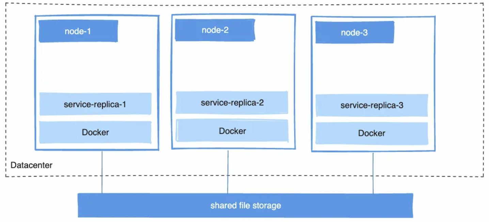

# Docker - advanced use
In this file we will analyze a little more advanced aspects of Docker, such as the different types of volumes, the networking between containers and the replicas if the service is replicated.

____
## Docker memory limitation
A container has no resource constraints by default configuration; but Docker provides ways to control how much memory or CPU a container can use - to ensure that no single container can monopolize system resources, lead to performance issues or service disruptions for other containers or host services.

This is extremely important because if the kernel detects insufficient memory for critical system functions, it throws an **Out Of Memory** Exception (OOM), and can potentially kill processes (including Docker) - Docker daemon can manage this problem.
These options are essential for maintaining the stability and performance of **both containers and the host system**.

We can specify the memory limitations in the `docker run` command or put **directly** the option **in the Docker Compose**.
In the first case we add the `--memory` flag as we can see here:
```
docker run --name container_name --memory=512m image_name
```
But we can also manage the limitation here (example seen in class):
```yml
services:
  producer:
    build: producer-end
    mem_limit: 512m
    environment:
      - SPRING_PROFILES_ACTIVE=docker
    depends_on:
      lavinmq:
        condition: service_healthy
```

In this case we use `mem_limit`, to set a basic memory limit for a container - **maximum amount of memory** that the container can use; but we can also use `mem_reservation`: it specify a **soft memory limit**, indicating the minimum amount of memory that should be reserved for the container. We can also combine both flags, for example (change a file seen in class):
```yml
services:
  product:
    build: microservices/product-service
    mem_limit: 512m
    mem_reservation: 256m
    environment:
      - SPRING_PROFILES_ACTIVE=docker
    depends_on:
      mongodb:
        condition: service_healthy
```

___
## Docker volumes
...

### Named Volumes
...

### Anonymous Volumes
...

### Bind Mounts
...


___
## Docker networking
Communication Between Containers\
allows containers to communicate with each other and with the external world\
f

...

### Same network
...


### Different networks
...

#### How to connect
...


___
## Docker replicas
Why to use, distributed, \
Docker-compose examples\
...


____
<p align="center">
  
</p>


