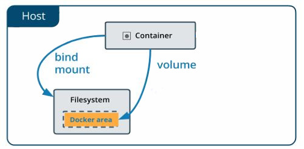

# Docker Compose Overview
Docker Compose is a powerful tool that allows us to define and manage multi-container Docker applications. It is particularly useful when working with microservice ecosystems, as it enables the easy launch and coordination of multiple containers simultaneously. With Compose, we can configure networking, define infrastructure as code, and meet scalability requirements.


## Compose file and life cycle management
The Compose file is the heart of Docker Compose, it consists of a YAML file (`docker-compose.yml`) that allows to define an application ecosystem including services, networking, disk space and more.

### Key syntax elements of the Compose file
The `docker-compose.yaml` file follows a hierarchical structure by the use of identations.
- **version**: Specifies the Compose version to use.
- **services**: Defines the containers of the application, each service represents a container.
  - **[service-name]**: Name of the single service, the choice is at our discretion.
    - **image**: Specifies the image to use for the service.
    - **build**: Alternative to `image`, allows to build an image from a specific dockerfile.
    - **ports**: Maps the host's ports.
    - **volumes**: Allows to share data between container and host or just between containers.
    - **networks**: Defines the networks which the containers will utilize to communicate.
    - **depends_on: `<service>`**: Defines a dependency between services, the specified service will start up first.
    - **enviroment**: Are used to pass enviroment variables in order to configure containers and applications within them.

### Basic example of `docker-compose.yml`
Now we will ease into writing the compose file starting from a simple [example](https://github.com/NakajimaAkemi/Microservices-containerization/tree/master/workdir/simple-compose), we will try to deploy a simple Flask application mapped to the port 5000.

`Project structure`
```
simple-compose/
│
├── app/
│   ├── app.py
│   └── requirements.txt
└── docker-compose.yml
```

`docker-compose.yml`:
```yaml
version: '3'
services:
  flask:
    build: ./app
    ports:
      - "5000:5000"
```

`app/app.py`:
```python
from flask import Flask

app = Flask(__name__)

@app.route('/')
def hello():
    return "Hello from Flask in Docker!"

if __name__ == "__main__":
    app.run(host='0.0.0.0', port=5000)
```

`app/app.py`:
```text
flask
```

`app/Dockerfile`:
```Dockerfile
FROM python:3.9-slim
WORKDIR /app
COPY requirements.txt requirements.txt
RUN pip install -r requirements.txt
COPY . .
CMD ["python", "app.py"]
```

Now with everything set up, we will start the ecosystem with the `docker-compose` command (we will talk about it shortly) in the context of the project directory.
```bash
docker-compose up
```
To test everything we can `curl` or use a browser to `http://localhost:5000` to get the "Hello from Flask in Docker!" message. 


## Lifecycle di Docker Compose
Now that we know how to setup a simple ecosystem with compose, we will show how to really manage it with CLI commands. Docker Compose allows us to manage the ecosystem's lifecycle with `docker-compose <command>`:
  - **`up`**: Start all services defined in the`docker-compose.yml` file.
  - **`down`**: Stops and removes all containers, networks, volumes defined in the compose file.
  - **`build`**: Builds the the Docker images specified in services.
  - **`logs`**: Views the logs of all containers in execution.
  - **`scale`**: Scales up or down the number of containers.

In the following sections we will introduce and explain various features of Docker compose, these features will allow us to set up and customize a multi-container ecosytem adapt to our necessities and use cases.

## Replicas
A **Replica** in Docker refers to the ability to istantiate more replicas of the same container, this allows us to scale horizontally improving the scalability, reliability and load balancing. 
To allow our service to replicate itself, we need first add a `deploy` field in the specific `service`, this field allows us to manage the container's behaviour across platforms, and its composed of:
 - `mode`: This indicate how to run the service **global** means one container per host or **replicated** to run on the same host machine.
 - `replicas`: If we assigned the **replicated** value on `mode` we need also to specify the number of containers we want.

> [!NOTE]
> If not specified the `mode` field is defaulted to the `replicated` value


We will create an [updated version](https://github.com/NakajimaAkemi/Microservices-containerization/tree/master/workdir/replica-compose) of our first example by adding  to the compose file and defining the number of replicas.

```yaml
version: '3'
services:
  flask:
    build: ./app
    ports:
      - "5000"
    deploy:
      mode: replicated
      replicas: 3
```
> [!NOTE]
> Since the service we're replicating is mapping ports, we will specify only port number and not the range, otherwise it will show an error.

As standard procedure we will start up the ecosystem and see the running containers.
```bash
docker-compose up
docker ps
```
Then we can verify by simply running a `docker ps` command and see the output (the output is totally indicative, it may vary).
```bash
CONTAINER ID   IMAGE        COMMAND         ...    PORTS
abc123         flask_app    "python app.py" ...    0.0.0.0:32768->5000/tcp
def456         flask_app    "python app.py" ...    0.0.0.0:32769->5000/tcp
ghi789         flask_app    "python app.py" ...    0.0.0.0:32770->5000/tcp
```
We can verify their reachability with a browser or the `curl` command:
 - http://localhost:32768
 - http://localhost:32769
 - http://localhost:32770

## Volumes and Bind Mounts
In this section we introduce `Volumes` and `Bind Mounts` as fundamental items for Docker containers that allow us to mantain to maintain persistent data survining beyond the container lifecycle, facilitating sharing data between containers, backup and restore
<p align="center">
  
</p>

### Differences
Docker provides the following persistence mechanisms:
Bind mounts link a directory on your local machine to a container. Unlike volumes, bind mounts directly reflect changes made on the host filesystem.
 - `Volumes` are directly managed by Docker and can survive beyond the container's lifecycle, usefull if we want persistence of our data.

 - `Anonymous volumes` are temporary volumes created by Docker when a container starts. They are typically used for temporary data, and they don't have a specific name, just because they are temporary.
These volumes are ephemeral and are removed when the container is removed.

 - `Bind mounts` allow you to mount a directory or file from the host machine into the container. Bind Mounts allow you to map a host file or directory to a container file or directory (bind mounts depend on the host's absolute path). 


Each mechanism of persistence has merits and application, here's a global overview of the differences:

| Feature                | Anonymous Volume                               | Named Volume                                  | Bind Mount                                   |
|------------------------|------------------------------------------------|-----------------------------------------------|----------------------------------------------|
| **Definition**          | Automatically created by Docker without a name | Defined and named manually by the user        | Links a host directory/file to a container path |
| **Persistence**         | Temporary, removed with the container          | Persistent, exists independently of the container | Depends on the host filesystem               |
| **Access from Host**    | Not directly accessible                        | Accessible via Docker commands                | Direct access from the host                  |
| **Typical Usage**       | Temporary or transient data                    | Persistent data (e.g., databases)             | Sync files during development                |
| **Security**            | Secure, Docker-managed                        | Secure, Docker-managed                        | Full host access                             |


_Is also important to say that if a service doesn't specify a volumes section, it means that the service won't have any volumes mounted. Essentially, **no data will be persisted outside the container** for that service._

### Volume definition

As we created our volume we can mount it to our container image.
```yml
version: '3.9'

services:
  web:
    image: nginx
    volumes:
      - my_data:/var/www/html  # Associa un volume a una directory nel container

volumes:
  my_data:  # Definizione del volume

```
As we can see in the example, the volume is set with [...] **:** [...].\
The first part is the name of the volume (in out case `flask_data`), the second one is the path in the container.


### Anonymous Volume definition

Nota: mettere una nota per impostare le difference tra bind mount e anonymous volume.


```yml
version: '3.9'

services:
  web:
    image: nginx
    volumes:
      - /var/www/html  # Volume anonimo
```
As we can see, we don't have the name, but only the path. It means that Docker Compose will create an anonymous volume without a specific name.


### Bind Mount definition
This is particularly useful during development when you want changes made on the host to be immediately reflected in the container.
In a nutshell: _we want to use the bind mounts when we need direct access to the host’s filesystem for development, testing, or sharing configuration files._
```yml
version: '3.9'

services:
  web:
    image: nginx
    volumes:
      - ./html:/var/www/html  # Associa una directory locale a una directory nel container

```


## Secrets
Secrets are any piece of sensitive data information(e.g., API keys, passwords...), that we want to securely handle and not be accessible to unauthorized processes and entities. 


#### Top level declaration
Secrets need to have a top-level secrets declaration that defines or references sensitive data. The source of the secret is either file or environment.

 - `file`: The secret is created with the contents of the file at the specified path.
 -  `environment`: The secret is created with the value of an environment variable

```yaml
secrets:
  server-certificate:
    file: ./server.cert
```

#### Secret assignment to a specific service
Secrets are designed to be tightly controlled, secure and only accessible (read-only) to services under `/run/secrets/` only when expicitly granted access in compose file. 

```yaml
services:
  frontend:
    image: example/webapp
    secrets:
      - server-certificate
```
### Practical example with API-key
This time we will set up a simple ecosystem of Flask server that access an API-key that is safely stored.
In this example we will show just the juicy parts the rest can be found [here](https://github.com/NakajimaAkemi/Microservices-containerization/tree/master/workdir/secret-compose).

`Project structure`
```
secret-compose/
│
├── app/
│   ├── app.py
│   └── requirements.txt
│   └── Dockerfile
│   └── api_key.txt
└── docker-compose.yml
```
We put our secret API-key in the text file `api_key.txt`
```bash
echo "my-super-secret-api-key" > api_key.txt
```
Now we reach the crucial part, in the `docker-compose.yaml` file, we define the `secrets` in a dedicated section and link the sensitive data using the `file` field. Next, we assign the specific secret to our service by adding a `secrets` section within the `service` definition, where we reference the names of the secrets we want to use.

```yaml
version: '3'

services:
  web:
    build: ./app
    ports:
      - "5000:5000"
    secrets:
      - api_key 

secrets:
  api_key:
    file: ./api_key.txt
```
Our Flask application will fetch the API key from the secrets.
```Python
from flask import Flask
import os

app = Flask(__name__)

@app.route('/')
def index():
    secret_file_path = '/run/secrets/api_key'
    if os.path.exists(secret_file_path) and os.path.isfile(secret_file_path):
        with open(secret_file_path, 'r') as secret_file:
            api_key = secret_file.read().strip()
        return f"Found the API key!"
    else:
        return "Secret file not found."

if __name__ == '__main__':
    app.run(host='0.0.0.0', port=5000)
```
We start up the compose file.
```bash
docker-compose up
```
And now we verify everything.
```bash
curl http://localhost:5000
```

### Why should we bother with secrets?
As in Docker-compose the secrets are in the form of files in the file system, why not use an enviroment variable or even a volume? Well the answer is simple, enviroment variables cause a risk of expose due to being accessible to all processes or even printed in log files (a simple `docker inspect` can expose the sensitive data). For volume first of all they are within the host file system allowing them to persist during the lifecycle while secrets are in-memory with read-only access.

#### Testing with Docker inspect
Let's define an ecosystem with a Flask server and a PostgreSQL database that needs authentication in order to enter. We just the docker-compose.yaml file were the magic happens, the whole project can be found [here](https://github.com/NakajimaAkemi/Microservices-containerization/tree/master/workdir/secret-compose). 
```YAML
version: '3'

services:
  db:
    image: postgres:latest
    environment:
      POSTGRES_DB: mydatabase
      POSTGRES_USER_FILE: /run/secrets/db_user
      POSTGRES_PASSWORD_FILE: /run/secrets/db_password
    secrets:
      - db_user
      - db_password
    volumes:
      - pg_data:/var/lib/postgresql/data

  flask_app:
    build:
      context: ./app
    depends_on:
      - db
    ports:
      - "5000:5000"
    secrets:
      - db_user
      - db_password
    environment:
      FLASK_ENV: development

secrets:
  db_user:
    file: db_user.txt
  db_password:
    file: db_password.txt

volumes:
  pg_data:
```
As we can see we put our credentials in txt files and loaded them as secrets, assigned them to the PostgreSQL service and passed them as ENV variables. But won't that expose them with a simple inspect command? Let's see, first of all we will find the service with a simple `docker ps` and then we inspect.
```bash
docker inspect <container-id>
```
The sadly for our attacker the output value ENV variables will be the generic path.
```json
"Env": [
    "POSTGRES_USER_FILE=/run/secrets/db_password",
    "POSTGRES_PASSWORD_FILE=/run/secrets/db_user"
]
```


## Networks

___________________________________

  - the **network**: as the same as volumes, we can create a new network with ```network create``` and remove it with ```network rm```

Networks allow containers to communicate with each other securely. Docker Compose automatically creates a default network, but you can define custom networks.

**Example:**

```yaml
version: '3'
services:
  web:
    image: nginx
    networks:
      - frontend
  db:
    image: mysql
    networks:
      - backend
networks:
  frontend:
  backend:
```


- **Networks**: networking is a passage through which all the isolated container communicate - there are mainly five network drivers in Docker (such as bridge, host, none, overlay, and macvlan); in Docker, networking is indeed a crucial component that allows isolated containers to communicate with each other.


### Networks

### Cos'è una Network?

Una **Network** Docker è un'entità virtuale che permette ai container di comunicare tra loro in un ambiente isolato. Docker crea automaticamente una network chiamata `bridge` per ogni container, ma è possibile creare e configurare network personalizzate.

### Tipi di Networks

- **Bridge**: Network standard per la comunicazione tra container su un singolo host.
- **Host**: I container condividono la network dell'host, con accesso diretto alle sue interfacce di rete.
- **Overlay**: Usata per collegare container che risiedono su diversi host Docker.
- **None**: Nessuna network è configurata; utile per container completamente isolati.

### Creazione e Gestione delle Networks

#### Creare una Network

Per creare una network:

```bash
docker network create my_network
```

#### Collegare un Container a una Network

Puoi collegare un container a una network specifica usando l'opzione `--network`:

```bash
docker run -d --network my_network my_image
```

#### Ispezionare una Network

Per vedere i dettagli di una network:

```bash
docker network inspect my_network
```

#### Rimuovere una Network

Per rimuovere una network non utilizzata:

```bash
docker network rm my_network
```


