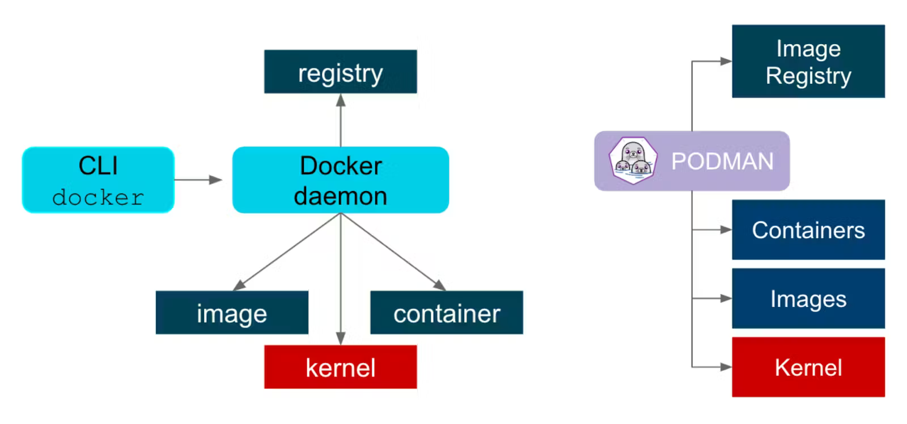
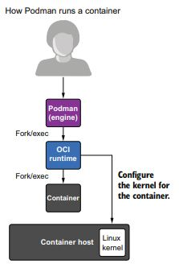
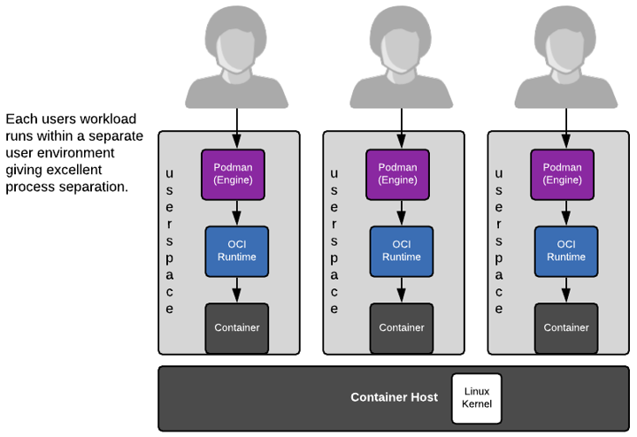
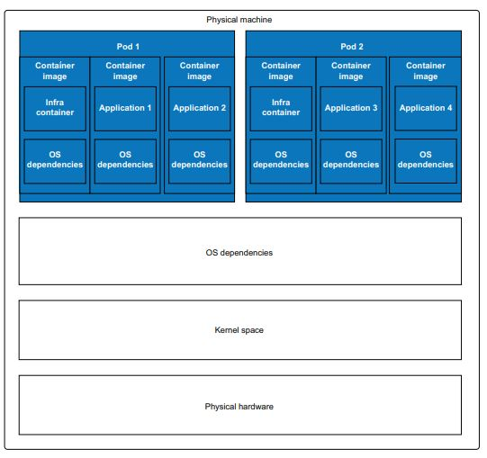

# Podman Overview
Podman (short for pod manages) is an open-source container management tool developed by Red Hat, designed to deploy and manage containerized applications. Podman in many cases works just like Docker, but it offers enhanced security and the ability to run commands with non-root privileges.

## Basic informations
 - **cgroup (control group)**: is a Linux kernel feature that allows the system to allocate, monitor, and limit resources (such as CPU, memory, and I/O) for a group of processes. It provides a way to manage and isolate the resource usage of applications and services, improving system performance and stability. Cgroups are essential for implementing containerization and resource management in Linux-based environments.
 - **fork/exec**: is a two-step process used in Unix-like operating systems for creating and running new processes. 
 - **PID (Process Identifier)**: is a unique numerical identifier assigned by the operating system to each process running on a system. It is used to manage and reference processes, enabling tasks such as process control, monitoring, and communication. PIDs help the operating system distinguish between different running processes.
 - **namespace**: is a feature in Linux that isolates and virtualizes system resources for a set of processes. It creates an environment where a process or a group of processes sees a distinct set of resources, such as file systems, network interfaces, process IDs, and user IDs. This isolation is key to containerization, allowing multiple containers to run on the same host without interfering with each other.

- **Userspace**: Userspace refers to the area of system memory where user-mode applications and processes run, as opposed to kernel space where the core of the operating system executes. It provides an isolated environment where applications operate with restricted access to hardware and system resources, ensuring system stability and security by preventing direct interaction with the kernel.

- **Orchestration**: Container orchestration is the automated management of containerized applications, handling deployment, scaling, networking, and availability across a cluster of machines. Tools like ```Kubernetes``` and ```Docker Swarm``` facilitate this process.

## Podman's architecture
<p align="center">
  
</p>
Podman is fundamentally different from Docker by being daemonless, Podman uses a more traditional fork-exec model to run containers, every command in Podman is executed as a process separated from the user. 
Podman's architecture is more robust and reliable than Docker's because it erases a single point of failure that is the daemon, if a daemon goes down, no container is reachable anymore.

<p align="center">
  
</p>

One benefit of the fork-exec model, it integrates well into the Linux kernel's audit system. This way, the system logs exactly which user executed which containers. 


## Rootless containers and user name-space separation

Probably the most significant feature of Podman is the ability to run containers in rootless mode. In many situations you don't want to give full root access to your users, but users and developers still need to run containers and build images. Every container process is managed with the current user's permissions, reducing the necessity of higher clearance.
<p align="center">
  
</p>

Also the support of the user namespace is an important functionality that allows us to execute containers in rootless mode, and allows us to isolate the container from the host and other processes in execution. Basically the user name-space allows us to define a `UID (user identifier)` and a `GID (group identifier)` mapping to run containers. 

>Example: While inside the container our UID may be 0 running as root inside, outside on the host it's considered with an unprivileged UID like 100000, also any file object that isn't mapped to the user namespace will be trated as owned by nobody and the container process will not be allowed access unless the object is accessible by others. Even if the process manages to escape the container, the kernel will treat it as UID=100000. 


## Concept of Pods

Podman introduces the concept of “pods,” which are groups of one or more containers that share the same network namespace and storage resources simulating a single host. This concept is borrowed from Kubernetes and allows for easier management of related containers.

<p align="center">
  
</p>

One of the design goals of containers is to separate services into single containers: microservices. Then you combine containers together to build larger services. Pods allow you to group multiple services
together to form a larger service managed as a single entity. One of the goals of Podman is allowing you to experiment with pods

## Systemd Integration
Podman Compose executes the Podman command directly, rather than communicating with Podman's API socket. This eliminates the need to run the Podman service to provide the API, saving resources. Because it uses Podman's regular command line and fork-exec model, it is easier to trace and manage on the system. For example, Podman Compose can easily be managed by a systemd unit file.

Podman and systemd allow you to manage
the entire life cycle of the application on nodes without human intervention


## Play kube
Init containers
Users of podman play kube told us they want to build images as part of the play process. Because Kubernetes does not have a similar concept, we were at first hesitant to implement the idea. The more play kube gets used, the more it gets compared to Docker compose. That was the tipping point. Our users were right.

The new podman play kube feature looks for a directory with the same name as the image used in the YAML file. If that directory exists and there is a Containerfile or Dockerfile present in that directory, Podman builds the container image.


## Why should we care about Podman?  

Podman is fundamentally design with security in mind, paving the way for running containers in high-security enviroments. A daemon running as root generally does not meet these requirements and has prevented lots of security-conscious companies from widespread adoption of Docker. Podman containers have always been rootless, while Docker is an all-in-1 tool for container management and creation, and including the fact that the architecture is daemon-less, the surface of attack is highly reduced.

## Podman and Docker compatability 
Podman is a powerful alternative to Docker, but the 2 can also work together,supporting most Docker commands and Dockerfile syntax. This compatibility makes transitioning from Docker to Podman smoother for developers. Some developers combine Podman and Docker, using Docker during the development stage and transferring their program to Podman in runtime environments. 


### Podman commands (bash)
One of Podman's greatest advantages is its CLI compatibility with Docker, because Podman does almost everything that Docker can do with the same command line as Docker. In fact, when building Podman, Docker users can adapt without any significant changes. For example, you can use the ```alias``` command to create a docker alias for Podman:
```
$ alias docker=podman
```
You can run other commands, such as ```pull```, ```push```, ```build```, ```commit```, ```tag```, and more with Podman. Podman’s CLI is similar to Docker’s, so users who are familiar with one are likely to have success with the other.

#### Podman exclusive commands
Podman other than having the same commands as Docker, it has also exclusive commands, which are ```kube```,
```systemd``` and ```pod```.

```podman pod```: Manages pods, which are groups of one or more containers sharing the same network namespace.
  For ```podman pod```, we can have:
  - ```create``` to **build** a pod;
  - ```start``` to **start** the pod;
  - ```stop``` to **stop** the pod;
  - ```rm``` to **remove** the pod;

  For ```podman generate systemd```, we can have:
  - ```create``` to **build** or rebuild services;
  - ```start``` to **start** the service (defined in the yaml file);
  - ```stop``` to **stop** and remove the service.
  - ```rm``` to **stop** and remove the service.
 Generates systemd unit files to manage containers or pods with systemd

  For ```podman <subcommand> kube```, we can have:
  - ```generate``` creates a **YAML** description of a Podman container or pod to run in Kubernetes;
  - ```play``` subcommand that allows Podman to **run** pods based on a Kubernetes YAML file;
Subcommand group for handling Kubernetes YAML file operation
podman play kube: Deploys containers based on Kubernetes YAML files.

<yaml file-name>

### dockerfile
Thanks to the ```OCI``` format, Podman support the same syntax and can build images from the dockerfile, meaning that Podman can ```pull/push``` images to/from Docker's registries, also the switch of the workflow from Docker to Podman and viceversa easier. 


### podman-compose
Podman supports the ```docker-compose.yml``` file, by processing them into Podman CLI commands with ```podman-compose```, while Podman Compose is better integrated with Podman (as it was designed from the ground up to work with Podman) and makes better use of rootless containers and pods. However, Docker Compose is much more supported, tested and more likely to be stable, while the Podman team is more focused ```podman generate kube``` and ```podman play kube```, which allow Kubernetes (An orchestation software) YAML to be used directly with Podman similar to Compose.


## Podman in depth
In this paragraph we will show basic functions of Podman, here's how install Podman on your machine:


### Rootless containers and user name-space isolation

Here we will show how to setup the rootless containers, but first of all we assume that we already have a non-root user, in case named brad and able to use podman. In order to use networking other than the host networking, Podman uses the slirp4netns package, it provides user-mode networking for unprivileged network namespaces and must be installed on the machine in order for Podman to run in a rootless environment.

> Note that the kernel still will not allow a non-privileged process to bind to ports less than 1024. 

First of we install the `slirp4netns` package
```shell
  apt-get install slirp4netns
```
After that we increase the number of user namespaces in the kernel.
```shell
 sudo sysctl user.max_user_namespaces=28633
 echo "user.max_user_namespaces=28633" | sudo tee -a /etc/sysctl.conf
 sudo sysctl -p
```


How podman does create the username space?
Most current Linux distributions include a version of shadow-utils that uses the /etc/subuid and /etc/subgid files to determine what UIDs and GIDs are available for a user in a user namespace.
```
cat /etc/subuid
bilel:100000:65536
brad:165536:65536
jon:231072:65536
```
```
cat /etc/subgid
bilel:100000:65536
brad:165536:65536
jon:231072:65536
```
The useradd program automatically allocates 65536 UIDs for each user added to the system. If you have existing users on a system, you would need to allocate the UIDs yourself manually. The format of these files is `username:STARTUID:TOTALUIDS`.
The manual allocation goes like this:
```
 echo "brad:165536:65536" | sudo tee -a /etc/subuid
 echo "brad:165536:65536" | sudo tee -a /etc/subgid
```
> Root privileges are required to add or update entries within these files.


Using an existing user name and group name (for example, brad), set the range of accessible user and group IDs that can be used for their containers. Here are a couple of warnings:

 - Don’t include the rootless user’s UID and GID in these ranges
 - If you set multiple rootless container users, use unique ranges for each user
It is recommended to use 65536 UIDs and GIDs for maximum compatibility with existing container images, but the number can be reduced
 - Never use UIDs or GIDs under 1000 or reuse UIDs or GIDs from existing user accounts (which, by default, start at 1000)

We add the configurations for UID and GID that will be mapped in the container in the files `/etc/subuid` e `/etc/subgid`. But first we take a look on the files and make sure that the ranges are not overlapping.
```
 cat /etc/subuid
 cat /etc/subgid
```
After our fist verification, we add the configurations for our user brad, keep note that the numbers may vary and the most important thing is to have a sufficient interval for our container.
```
 echo "brad:165536:65536" | sudo tee -a /etc/subuid
 echo "brad:165536:65536" | sudo tee -a /etc/subgid
 cat /etc/subuid
 cat /etc/subgid
```
We can check the our rootless configuration is set up properly by running tge `podmman unshare` command inside the modified user namespace:
```
podman unshare cat /proc/self/uid_map
         0       1001     1
         1       100000   65536
```
After our configuration we can run our image with the user brad by exposing port 8080.
```
podman run -d -p 8080:8080 your-image
podman ps
```
Output:
```
CONTAINER ID  IMAGE                     COMMAND               CREATED        STATUS            PORTS                   NAMES
f3b9c6d5eabc  localhost/hello-world-image:latest  python3 server.py  5 minutes ago  Up 5 minutes ago  0.0.0.0:8080->8080/tcp  nostalgic_morse
```
We check with the command below that the process of our container is owned by brad, basically we are able to run our application container with root-less privileges.
```
ps aux | grep nostalgic_morse
brad       12662  0.0  0.0   4024  2048 pts/0    S+   09:55   0:00 grep --color=auto musing_bhabba
```

The command `podman top` allows us to examine the usernames of processes running insisde a container and identify their real UID on the host.

$ sudo podman top --latest user huser
Notice podman top reports that the user process is running as root inside the container but as UID 100000 on the host (HUSER). 
sudo podman run --uidmap 0:200000:5000 -d fedora sleep 1000
$ sudo podman top --latest user huser
USER   HUSER
root   200000


Podman executes these files to set up the user namespace. You can see the mappings by examining /proc/self/uid_map and /proc/self/gid_map from inside of the rootless container.

$ podman run alpine cat /proc/self/uid_map /proc/self/gid_map
     	0   	3267      	1
     	1 	100000  	65536
     	0   	3267      	1
     	1 	100000  	65536

As seen above, Podman defaults to mapping root in the container to your current UID (3267) and then maps ranges of allocated UIDs/GIDs in /etc/subuid and /etc/subgid starting at 1. Meaning in my example, UID=1 in the container is UID 100000, UID=2 is UID 100001, all the way up to 65536, which is 165535.


Una volta fatto il setup del namespace
Podman uses containers/storage to pull the container image, and containers/storage is smart enough to map all files owned by root in the image to the root of the user namespace, and any other files owned by different UIDs to their user namespace UIDs. By default, this content gets written to ~/.local/share/containers/storage. Container storage works in rootless mode with either the vfs mode or with Overlay. Note: Overlay is supported only if the fuse-overlayfs executable is installed.

The kernel only allows user namespace root to mount certain types of filesystems; at this time it allows mounting of procfs, sysfs, tmpfs, fusefs, and bind mounts 


### Systemd


### Pods setup
In this paragraph we analyze the Chapter 6 of the [Magnus Larsson repository](https://github.com/PacktPublishing/Microservices-with-Spring-Boot-and-Spring-Cloud-Third-Edition/tree/main/Chapter06).\

It is important to notice that in the microservices folder there are 4 services. Let's analyze each Dockerfile, then we can watch the Docker Compose whose use this files.


### Systemd 


### Kube play


## Sources
- https://www.redhat.com/en/topics/containers/what-is-podman
- https://github.com/containers/podman/blob/main/docs/tutorials/rootless_tutorial.md
