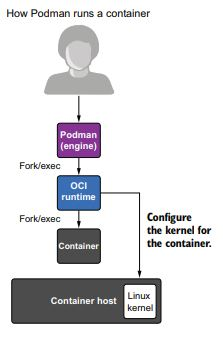

# Podman Overview
Podman (short for pod manages) is an open-source container management tool developed by Red Hat, designed to deploy and manage containerized applications. Podman in many cases works just like Docker, but it offers enhanced security and the ability to run commands with non-root privileges.

## Basic informations
 - **fork/exec**: is a two-step process used in Unix-like operating systems for creating and running new processes. 
 - **PID (Process Identifier)**: is a unique numerical identifier assigned by the operating system to each process running on a system.
 - **namespace**: is a feature in Linux that isolates and virtualizes system resources for a set of processes. It creates an environment where a process or a group of processes sees a distinct set of resources, such as file systems, network interfaces, process IDs, and user IDs. 

- **systemd**:**systemd** is a system and service manager for Linux operating systems. It is responsible for initializing the system (booting it up) and managing system processes and services once the system is running;

- **Orchestration**: Container orchestration is the automated management of containerized applications, handling deployment, scaling, networking, and availability across a cluster of machines. Tools like ```Kubernetes``` and ```Docker Swarm``` facilitate this process.

## Podman's architecture
<p align="center">
  
</p>
Podman is fundamentally different from Docker by being daemonless, Podman uses a more traditional fork-exec model to run containers, every command in Podman is executed as a process separated from the user. 
Podman's architecture is more robust and reliable than Docker's because it erases a single point of failure that is the daemon, if a daemon goes down, no container is reachable anymore.

<p align="center">
  
</p>

One benefit of the fork-exec model, it integrates well into the Linux kernel's audit system. This way, the system logs exactly which user executed which containers. 


## Rootless containers and user name-space separation

Probably the most significant feature of Podman is the ability to run containers in rootless mode. In many situations you don't want to give full root access to your users, but users and developers still need to run containers and build images. Every container process is managed with the current user's permissions, reducing the necessity of higher clearance.
<p align="center">
  
</p>
_Figure: shows multiple users running Podman independent of each other, without any root access._

Also the support of the user namespace is an important functionality that allows us to execute containers in rootless mode, and allows us to isolate the container from the host and other processes in execution.
Basically the user name-space allows us to define ranges of `UIDs (user identifiers)` and a `GIDs (group identifiers)` mapping from the host to completely different values in the container process. It allows processes to have privileges inside of the container, but no privileges if they escape the container.


>Example: While inside the container our UID may be 0 running as root inside, outside on the host it's considered with an unprivileged UID like 100000, also any file object that isn't mapped to the user namespace will be trated as owned by nobody and the container process will not be allowed access unless the object is accessible by others. Even if the process manages to escape the container, the kernel will treat it as UID=100000. 


## Pods

Podman introduces the concept of “pods,” which are groups of one or more containers that share the same network namespace and storage resources simulating a single host. This concept is borrowed from Kubernetes and allows for easier management of related containers.

One of the design goals of containers is to separate services into single containers: microservices. Then you combine containers together to build larger services. Pods allow you to group multiple services
together to form a larger service managed as a single entity. One of the goals of Podman is allowing you to experiment with pods

<p align="center">
  
</p>

Every Podman pod includes an `infra container`. This container holds the namespaces associated with the pod and allows Podman to connect other containers to the pod. It allows you to start and stop containers within the pod and the pod will stay running.

Reasons why pods should be considered:
 - Expose your frontend application to the public network.Protect your database container in a private network. (I use pods to group and isolate related containers, e.g. an app and its database in a pod so they can easily be started and stopped together and communicate over localhost while remaining isolated from other containers.)
 - Group of Containers: Like in Kubernetes, a pod in Podman is a group of one or more containers that share the same network and storage namespace. This allows the containers within a pod to communicate with each other using localhost, share IP addresses, and share storage volumes. Network sharing: Containers in a Podman pod share the same network namespace, which means they can interact with each other without needing special network configurations. They also share the same hostname, which makes inter-container communication straightforward. Convenient Management: Pods in Podman provide a convenient way to manage multiple containers as a single unit. For example, starting, stopping, or removing a pod will affect all containers within that pod, which is useful for operational efficiency.

 - Pods abstraction :They allow users to group containers together under a single management unit, simplifying operations like starting, stopping, or restarting all containers within the pod simultaneously.


 - Microservices and Component Grouping: If you have multiple containers that need to work together as part of a microservices architecture (like a web server and a database), placing them in the same pod allows them to communicate easily and share resources like storage.

 - Resource Sharing: Similar to Kubernetes, containers in a Podman pod can share volumes, making it easy to share data between them.
 - Podman is designed to be compatible with Kubernetes, meaning you can create and manage pods locally using Podman and then easily transition to running them in a Kubernetes environment. This is useful for development and testing before deploying to a production Kubernetes cluster.


## Systemd Integration

**Currently on hold due to heterogeneity of the versions**


## Play kube
Init containers
Users of podman play kube told us they want to build images as part of the play process. Because Kubernetes does not have a similar concept, we were at first hesitant to implement the idea. The more play kube gets used, the more it gets compared to Docker compose. That was the tipping point. Our users were right.

The new podman play kube feature looks for a directory with the same name as the image used in the YAML file. If that directory exists and there is a Containerfile or Dockerfile present in that directory, Podman builds the container image.


## Why should we care about Podman?  

Podman is fundamentally design with security in mind, paving the way for running containers in high-security enviroments. A daemon running as root generally does not meet these requirements and has prevented lots of security-conscious companies from widespread adoption of Docker. Podman containers have always been rootless, while Docker is an all-in-1 tool for container management and creation, and including the fact that the architecture is daemon-less, the surface of attack is highly reduced.

## Podman and Docker compatability 
Podman is a powerful alternative to Docker, but the 2 can also work together,supporting most Docker commands and Dockerfile syntax. This compatibility makes transitioning from Docker to Podman smoother for developers. Some developers combine Podman and Docker, using Docker during the development stage and transferring their program to Podman in runtime environments. 


### Podman commands (bash)
One of Podman's greatest advantages is its CLI compatibility with Docker, because Podman does almost everything that Docker can do with the same command line as Docker. In fact, when building Podman, Docker users can adapt without any significant changes. For example, you can use the ```alias``` command to create a docker alias for Podman:
```
$ alias docker=podman
```
You can run other commands, such as ```pull```, ```push```, ```build```, ```commit```, ```tag```, and more with Podman. Podman’s CLI is similar to Docker’s, so users who are familiar with one are likely to have success with the other.

#### Podman exclusive commands
Podman other than having the same commands as Docker, it has also exclusive commands, which are ```kube```,
```systemd``` and ```pod```.

```podman pod```: Manages pods, which are groups of one or more containers sharing the same network namespace.
  For ```podman pod```, we can have:
  - ```create``` to **build** a pod;
  - ```start``` to **start** the pod;
  - ```stop``` to **stop** the pod;
  - ```rm``` to **remove** the pod;

  For ```podman generate systemd```, we can have:
  - ```create``` to **build** or rebuild services;
  - ```start``` to **start** the service (defined in the yaml file);
  - ```stop``` to **stop** and remove the service.
  - ```rm``` to **stop** and remove the service.
 Generates systemd unit files to manage containers or pods with systemd

  For ```podman <subcommand> kube```, we can have:
  - ```generate``` creates a **YAML** description of a Podman container or pod to run in Kubernetes;
  - ```play``` subcommand that allows Podman to **run** pods based on a Kubernetes YAML file;
Subcommand group for handling Kubernetes YAML file operation
podman play kube: Deploys containers based on Kubernetes YAML files.

<yaml file-name>

### dockerfile
Thanks to the ```OCI``` format, Podman support the same syntax and can build images from the dockerfile, meaning that Podman can ```pull/push``` images to/from Docker's registries, also the switch of the workflow from Docker to Podman and viceversa easier. 


### podman-compose
Podman supports the ```docker-compose.yml``` file, by processing them into Podman CLI commands with ```podman-compose```, while Podman Compose is better integrated with Podman (as it was designed from the ground up to work with Podman) and makes better use of rootless containers and pods. However, Docker Compose is much more supported, tested and more likely to be stable, while the Podman team is more focused ```podman generate kube``` and ```podman play kube```, which allow Kubernetes (An orchestation software) YAML to be used directly with Podman similar to Compose.


## Podman in action
In this paragraph we will show basic functions of Podman, here's how install Podman on your machine:


### Pods setup
#### Pod creation
First of all we create our own pod with the following command and check the existense of our pod:
```
podman pod create --name mypod
podman pod ps
```
As we can see from the output, there is a container inside the pod, and that's the default infra container.

#### Running a container inside the pod
We can a container inside the pod we just created.
```
podman run -dt --name myubi --pod mypod registry.access.redhat.com/ubi8/ubi /bin/bash
```
This time if we run the `podman pod ps` command we can see that the number of pods increased to 2 containers. And if we run:
```
podman ps -a --pod
```
We can list all pods and the images associated with them.
###
In this paragraph we analyze the Chapter 6 of the [Magnus Larsson repository](https://github.com/PacktPublishing/Microservices-with-Spring-Boot-and-Spring-Cloud-Third-Edition/tree/main/Chapter06).\

It is important to notice that in the microservices folder there are 4 services. Let's analyze each Dockerfile, then we can watch the Docker Compose whose use this files.

#### Pod's informations

We can get information about the processes that are running inside the pod with 
```
podman pod top mypod
```

Or we can inspect the pod, showing information that describes the pod
```
podman pod inspect mypod
```

### Kube play


## Sources
- https://www.redhat.com/en/topics/containers/what-is-podman
- https://github.com/containers/podman/blob/main/docs/tutorials/rootless_tutorial.md
