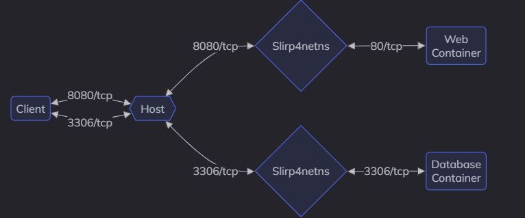
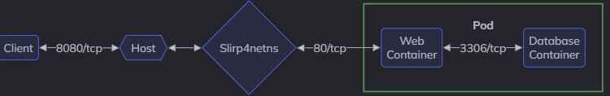
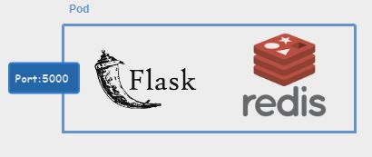

# Overview
In this section we will show more specific applications of Podman, such as Pods and Podman kube functionalities.


## Pods

Podman introduces the concept of pods, which are groups of one or more containers that share the same network namespace and storage resources simulating a single host. This concept is borrowed from Kubernetes and allows for easier management of related containers. Pods allow you to group multiple services
together to form a larger service managed as a single entity.

<p align="center">
  
</p>

Every Podman pod includes an `infra container`. This container holds the namespaces associated with the pod and allows Podman to connect other containers to the pod. It allows you to start and stop containers within the pod and the pod will stay running.

*Why should pods be considered?*
 - **Further Backend isolation**: Expose your frontend application to the public network and protect your database container in a private network, they will communicate over localhost while remaining isolated from other containers.
 - **Network sharing**: Containers in a Podman pod share the same network namespace, which means they can interact with each other without needing special network configurations.
 - **Convenient Management**: We can manage multiple containers as a single unit such as starting, stopping, or removing, affecting all containers within that pod.
 - **Resource Sharing**: Containers in a Podman pod can share volumes.
 - **Compatability with Kubernetes**: you can create and manage pods locally using Podman and then easily transition to running them in a Kubernetes environment;


### Pod management CLI commands
```podman pod```: Manages pods, which are groups of one or more containers sharing the same network namespace.
  For ```podman pod```, we can have:
  - ```create``` to **build** a pod;
     - ```--name <pod-name>```: specifies a name for the Pod, otherwise it's randomly generated.
     - ```--network <network-name>```: Attaches a network to the pod.
     - ```-p <port-range>```: Exposes the port.
     - ```--volume <..options..>```: attaches a volume into the pod.
     - ```--secret <secret-data>```: attaches a secret into the pod. 
     - ```-e <MY_VARIABLE>=<my_value>```: attaches an enviroment variable into the pod. 
  - ```start``` to **start** the existing pod;
  - ```stop``` to **stop** the pod;
  - ```rm``` to **remove** the pod;
  - ```ps``` to **show** running pods;
  - ```top <pod-name>``` to **show** running containers inside the pod;
  - ```inspect <pod-name>``` to **inspect** the running pod;

#### Volume and Secret mounting 
`Volumes` or `Bind mount` is attached a to Pod are accessible to all containers inside. Same thing for `secrets`.


#### Pods networking
There is no direct link of communication between containers, they sorta live in their own bubble and cannot reach eachother internally, both need to be reachable from the host network to be able to talk to each other. Exposing internal services that only other containers should talk to this way is not recommended since it exposes them out to clients as well.
<p align="center">
  
</p>
Using Pods instead automatically creates automatically a bridge network between the containers, it is comes in handy in cases where you need 2 or more containers to talk to each other without exposing unnecessary ports.
<p align="center">
  
</p>


As for the communication between pods, we need to configure a network in order to allow them to communicate. 


### Pods setup
#### Pod creation
First of all we create our own pod with the following command and check the existense of our pod:
```bash
podman pod create --name my-nginx-pod
podman pod ps
```
As we can see from the output, there is a container inside the pod, and that's the default infra container.

#### Running a container inside the pod
We can a container inside the pod we just created, basically it's just the basic `podman run` command with `--pod <pod-name>` option added.
```bash
podman run -d --pod my-nginx-pod --name my-nginx -p 8080:80 nginx:latest
```
Everything is setup by command line, may it be the port forwarding, volume attachments and more.


#### Example of multicontainer Pod
Now we will try to run a Pod that runs a Flask server with Redis for data collection.
In the  [example](https://github.com/NakajimaAkemi/Microservices-containerization/tree/master/workdir/redis-pod) the server is exposed at port 5000, while it communicates locally with the Redis service.

<p align="center">
  
</p>

First of all we creat the pod `flask-redis-pod`
```bash
# Create the pod and expose port 5000 and build our Flask image.
podman pod create --name flask-redis-pod -p 5000:5000
podman build -t my-flask-redis-app .
```
Then we run our containers inside the Pod.
```
podman run -d --pod flask-redis-pod  --name redis redis:latest
podman run -d --pod flask-redis-pod --name flask-app my-flask-redis-app
```
We can test saving the key via `curl` of Postman
```bash
curl -X POST -H "Content-Type: application/json" -d '{"value": "Hello, Redis!"}' http://localhost:5000/set/mykey
```
For windows CMD
```bash
curl -X POST -H "Content-Type: application/json" -d "{\"value\": \"Hello, Redis!\"}" http://localhost:5000/set/mykey
```
Then we can fetch the key with `curl` or Browser
```bash
curl http://localhost:5000/get/mykey
```


## Podman kube
Podman provides a feature where given a Pod, we can gerate and run a Kubernetes manifest YAML file trough the commmand ```podman <subcommand> kube```:
  - ```generate``` creates a **YAML** description of a Pod.
  - ```play``` subcommand that allows Podman to **run** Pods based on a Kubernetes YAML file;

Let's say that we have the Pod `my-nginx-pod` that we defined in the section before, with that we generate the YAML manifest file:

```bash
podman kube generate my-nginx-pod > my-nginx-pod.yaml
```
Now we can run the Pod trough the YAML file file the `play` command:
```bash
podman play kube my-nginx-pod.yaml
```

With this we can seamlessly transition the workload to Kubernetes.


## Sources
 - https://www.osource.se/pages/howtos/202308291847.html#containers


