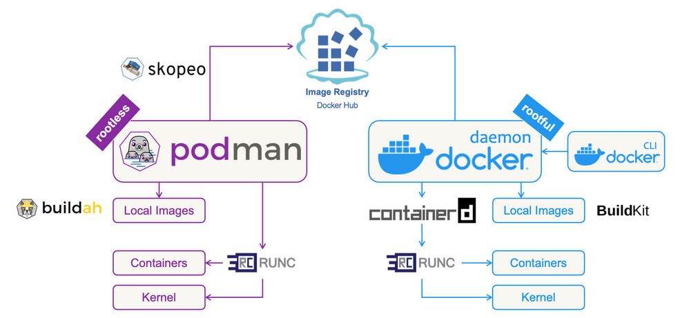

# Podman in action

## _
leveraing SELinux.
Integrated with systemd
Default approcah on Fedora and RHEL.

Not everybody has the luxury to build all thier own containers from scratch, because it would be an added cost stemming from the maintenance needs, such as patching a security issue.
Base OS also?
Another issue it other tools that run along side the container technology.


You can also use Podman to run secure, rootless containers. By joining a user namespace and setting root access inside, you can enable Podman to mount certain filesystems and set up the container with no escalation of privileges.

**Dockerfile**


```dockerfile
FROM eclipse-temurin:21-jdk as builder
WORKDIR extracted
ARG JAR_FILE=target/*.jar
COPY ${JAR_FILE} application.jar
RUN java -Djarmode=layertools -jar application.jar extract
EXPOSE 8080
```

--Advantages and used cases--


--Podman Desktop--

--Deployment in Podman--


##  Podman's Toolbox

Docker is an all-in-1 tool for container creation and management, whereas Podman and its associated tools like Buildah and Skopeo are more specialized for specific aspects of containerization. This makes it possible to customize your environments with only the tools you need.


Buildah is another container engine,
although it is only used for building container images.

Podman is a modular container engine, so it must work alongside tools like Buildah and Skopeo to build and move its containers. With Buildah, you can build containers either from scratch or by using an image as a starting point. Skopeo moves container images between different types of storage systems, allowing you to copy images between registries like docker.io, quay.io, and your internal registry or between different types of storage on your local system. This modular approach to containerization results in a flexible, lightweight environment by reducing overhead and isolating the features you need. Working with containers makes it possible to use smaller, more modular tools that can focus on a single purpose and be updated as often as needed.

Think of Podman, Buildah, and Skopeo as a set of specialized Swiss Army knives. Combined, they can satisfy almost all container use cases. Podman is the biggest of these knives.

Podman and Buildah use runC―the OCI runtime―by default to launch containers. You can use runC to build and run an image, or you can use it to run Docker-formatted images. This Go language-based tool reads a runtime specification, configures the Linux kernel, and eventually creates and starts container processes. With some configuration changes, you can also use Podman with other footprints like crun.

Docker is not only a standard but also a  swiss army knife of functionalities, runs, mantains and builds containers and so on. Podman applies tool for the specific functionalities such as Skopeo and Buildah to build images. 

Buildah is all about building OCI compatible images, we can use the Docker format, or use Multi stage builds supported with and without dockerfiles. Has customizable image layer caching. We can build OCI images as non root user, if we got a multi-user development enviroment maybe linuc with their own shell access we can build them without doing it as root or without special privileges, basically with a smaller attack surface.


<p align="center">
  
</p>


-- buildah and skopeo -- 


## Rootless containers
Why rootless containers? These containers can be created and run by users without admin rights.
Aside from the security advantages they be run by different users.


## Rootless Containers


## Buildah


## Skopeo


## SELinux and AppArmor


## Logging and Monitoring


# Pods

# Systemd
Podman and systemd allow you to manage
the entire life cycle of the application on nodes without human intervention

# User namespace separati


--  System md --


-- Security politics -- 
SELinux configuration user name spaces and volumes
AppArmor


-- CI/CD integration --

-- logging and monitoring -- 


-- secrets management --

