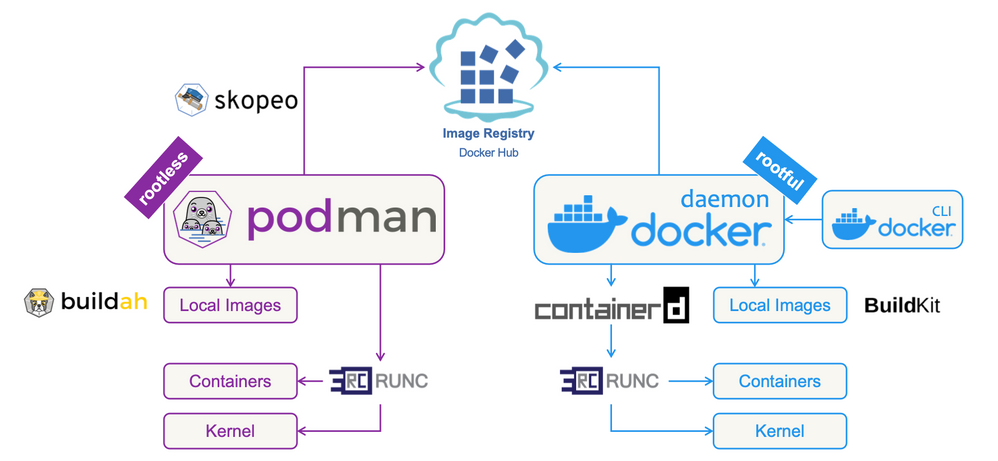

##  Podman's Toolbox

Docker is an all-in-1 tool for container creation and management, whereas Podman and its associated tools like Buildah and Skopeo are more specialized for specific aspects of containerization. This makes it possible to customize your environments with only the tools you need.

Buildah is another container engine,
although it is only used for building container images.

Podman is a modular container engine, so it must work alongside tools like Buildah and Skopeo to build and move its containers. With Buildah, you can build containers either from scratch or by using an image as a starting point. Skopeo moves container images between different types of storage systems, allowing you to copy images between registries like docker.io, quay.io, and your internal registry or between different types of storage on your local system. This modular approach to containerization results in a flexible, lightweight environment by reducing overhead and isolating the features you need. Working with containers makes it possible to use smaller, more modular tools that can focus on a single purpose and be updated as often as needed.

Think of Podman, Buildah, and Skopeo as a set of specialized Swiss Army knives. Combined, they can satisfy almost all container use cases. Podman is the biggest of these knives.

Podman and Buildah use runC―the OCI runtime―by default to launch containers. You can use runC to build and run an image, or you can use it to run Docker-formatted images. This Go language-based tool reads a runtime specification, configures the Linux kernel, and eventually creates and starts container processes. With some configuration changes, you can also use Podman with other footprints like crun.

Docker is not only a standard but also a  swiss army knife of functionalities, runs, mantains and builds containers and so on. Podman applies tool for the specific functionalities such as Skopeo and Buildah to build images. 

Buildah is all about building OCI compatible images, we can use the Docker format, or use Multi stage builds supported with and without dockerfiles. Has customizable image layer caching. We can build OCI images as non root user, if we got a multi-user development enviroment maybe linuc with their own shell access we can build them without doing it as root or without special privileges, basically with a smaller attack surface.

  

## Buildah
Buildah is a utility for creating Open Container Initiative (OCI) compatible container images. Buildah provides a wider range of customization options than the more generic podman build command.
If you create container images by using Buildah, you don't need a running daemon for the utility to function. Buildah also doesn't cache builds by default. In addition, the utility can push container images to container registries, so it's suited for use with deployment scripts and automated build pipelines.

The primary difference between Buildah and Podman is in the way that the run command is handled. Because Buildah's purpose is to build images, the run command behaves the same as a RUN statement within a Containerfile, which is a configuration file that contains the required settings to automate the creation of a container image.

This difference makes it easy to separate image builds from production level container infrastructure, running in Podman, and to easily process existing Containerfile build instructions.

## Skopeo

